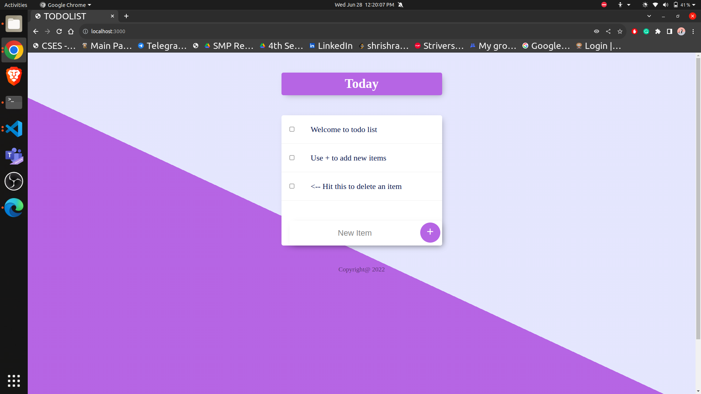

# Todolist

## Description
Welcome to The [**Todolist**](https://fine-gold-beetle-tux.cyclic.app/), your go-to destination website for effective task management of individuals.

## Website Link

https://fine-gold-beetle-tux.cyclic.app/

## Screenshot
<p align="left">
  
  
</p>
<br>
<br>

## Requirements
[Todolist](https://github.com/AbhishekYMNNIT/Todolist) is a NodeJS application based on MongoDB.

For codebase usse the package manager [npm](https://www.npmjs.com/) to install [Todolist](https://github.com/AbhishekYMNNIT/Todolist).

<br>

## Installation
```bash
git clone https://github.com/AbhishekYMNNIT/Todolist.git
npm install
nodemon app.js
```

## Maintainers 👨‍💻

- ### [Shrish Raj Gupta](https://github.com/ShrishRajGupta)   [](https://www.linkedin.com/in/shrishrajgupta/)
- ### [Abhishek Yadav](https://github.com/AbhishekYMNNIT)  [](https://www.linkedin.com/in/abhishekyadav123/)

## Licence 🍁
**ISC**

## Contributing 💙

PR's are welcome !

Found a Bug ? Create an Issue.

## 💖 Like this project ?

Leave a ⭐ If you think this project is cool.